**How to upload file and how to use File upload Template**

1  Navigate to **Test Development** section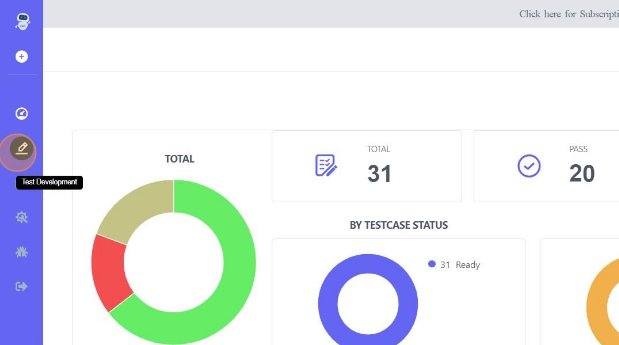

2  Click on **Uploads![ref1]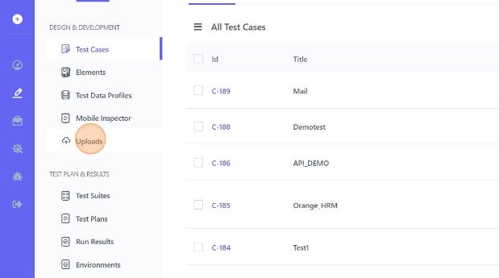**

2  Click on **Upload![ref2]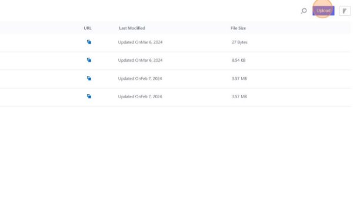**

4  Click on **Choose File![ref1]**

4  Click on **sample file![ref2]**

6  Click on **Open![ref1]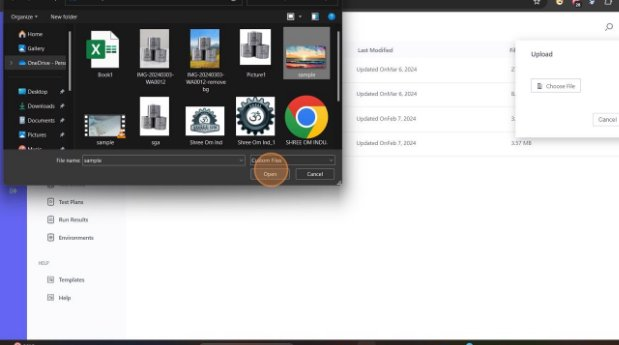**

6  Click on **Upload![ref2]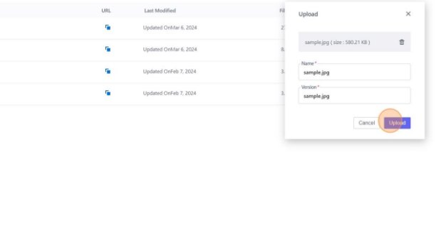**

8  A notification stating **App Upload in progress** will be seen![ref1]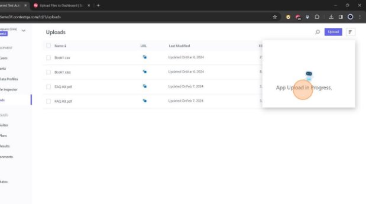

8  Click on **copy icon** to copy **URL** of the uploaded file![ref2]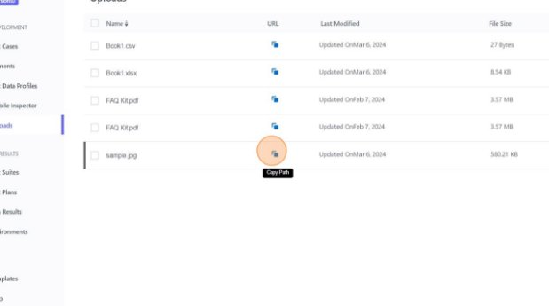

10  Click on **TestCases![ref1]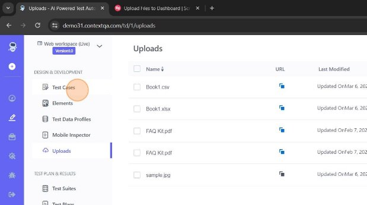**

10  Click on **Test Case![ref2]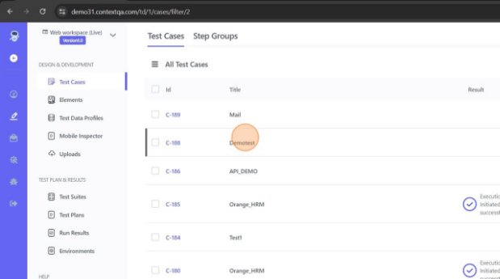**

12  Add **Upload** Template![ref1]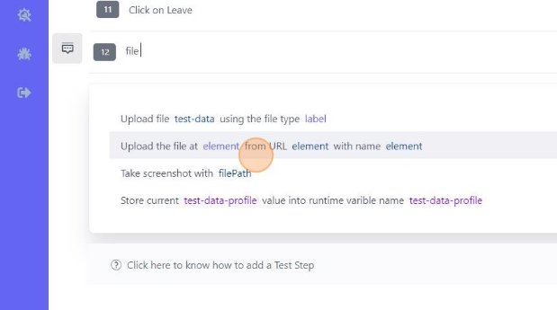

12  Click on **Edit** icon![ref2]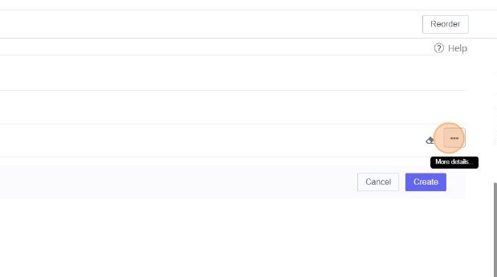

14  input the element.![ref1]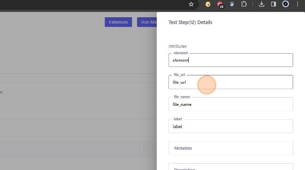

14  Enter the **File** **URL** which we copied (step 9)![ref2]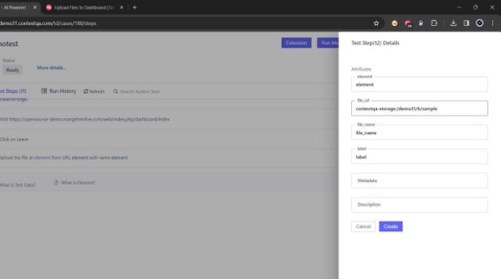

16  Discard the text till colon and forward slash (Ex: "contextqa-storage:/") and keep the rest![ref1]

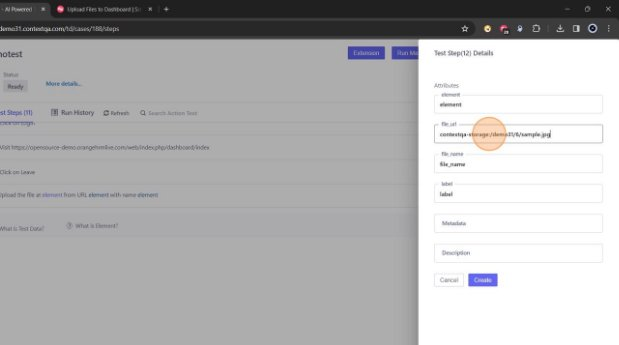

17  Add a suitable **file\_name![ref2]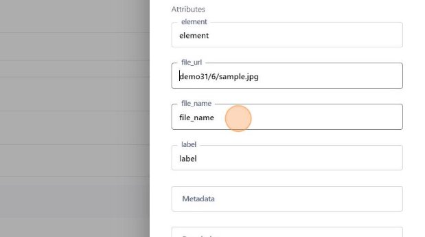**

18  Add **label** and click on **Create![ref1]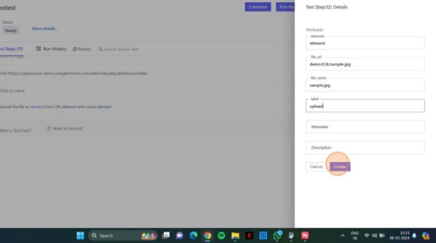**

18  Click on **Create![ref2]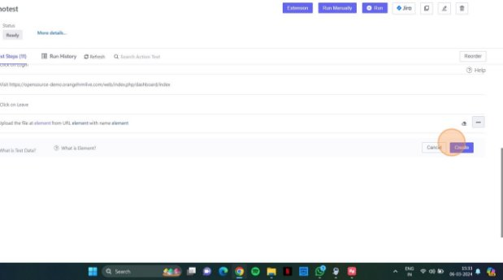**

20  File is uploaded successfully![ref1]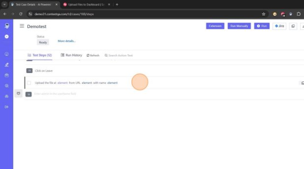

Made with Scribe - https://scribehow.com 11

[ref1]: ./images/Aspose.Words.86ce1d00-1454-4a52-9cba-6d8d9640f6bb.003.png

[ref2]: ./images/Aspose.Words.86ce1d00-1454-4a52-9cba-6d8d9640f6bb.005.png
