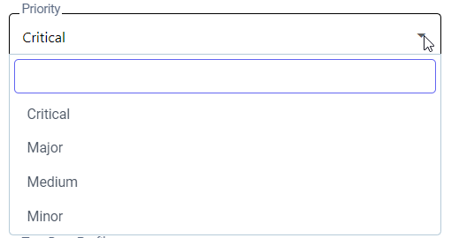
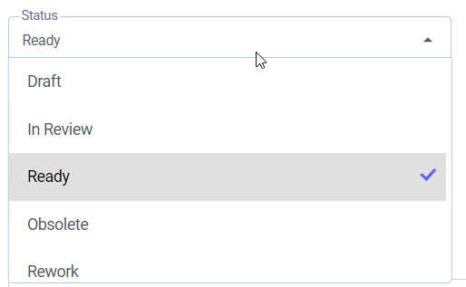
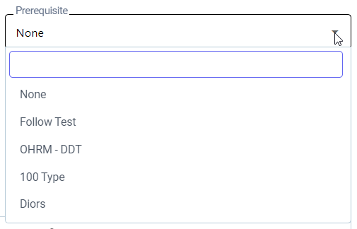
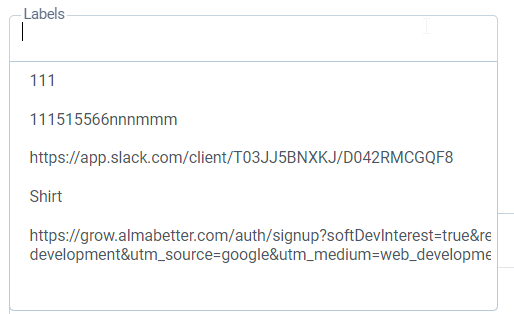

## **4.3 Advance Options** 
Test case advanced options help you manage or group test cases better while creating test suites, test plans and understanding the test coverage.

To view the advanced options for you test case, click on Show advanced options on the Create test case page.

**Steps:** 

1. Go to **Portal** 
2. On the Left Hand Side There Will Be A **Pencil Icon (Test Development)** Click on it 
3. Choose a **Test Case** From **Design And Development List** 
5. The **Test Case** List Will Open As Shown In the Screenshot Below 

5. On the right-hand side click on **Create** button
6. Click on **Show Advance Options** 

The advanced options available are as follows:

1. **Adding Priority(Required):** Select the priority level that you want to set for this test case. 
   1. Critical – Highest priority
   2. Major – Test case for a major feature
   3. Medium – Medium priority
   4. Minor – Test case for a minor feature

2. **Type (Required)**: Select any of the below test method type that needs to be gratified using this test case. 

1. Unit test
2. Integration
3. Functional
4. Non-functional
5. User Experience

3. **Status (Required)**: Test case status is used for organizing and managing the testing workflow. Select the appropriate status from the given options :**Draft, In Review, Ready, Obsolete, Rework**  as shown in the screenshot below

Select the appropriate status for the Test Case.
Note: Only Test Cases in ready state will be available for execution.

1. Draft – Test case is in an abstract mode.
2. Review- Test Case is under inspection.
3. Ready- Test Case is active and ready to be executed.
4. Obsolete- Test Case is no longer valid.
5. Rework – Test Case needs to be updated.

**Prerequisite (Required)**: Select another Test Case as a prerequisite for this Test Case. This will help you save execution time when a prerequisite condition is not met.

For example, in the case of an e-commerce shopping website, the test case Add Items to Cart would be a prerequisite for Place Order since an order cannot be placed in an empty Cart. If the Add Items to Cart Test Case is not added to the Test Suite, the Test will fail in most cases. Therefore, it would be beneficial to add it as a prerequisite for the Place Order Test Case.

1. **Labels**: You can assign existing tags to the test cases or create new tags.

2. **Test Data Profile:** Select the Test Data profile to be used in the Test Case. This is required only if you are going to use parameter type test data in your test steps. 

3. **Data-Driven (toggle)**: Enable this if you want to run the same test case repeatedly, each time with a different set of data for the input fields. You will need to add a Test Data Profile before enabling this option as shown.

4. Enter  **Data Iterates from, Data Iterates Till** 
5. Edit **Description**

