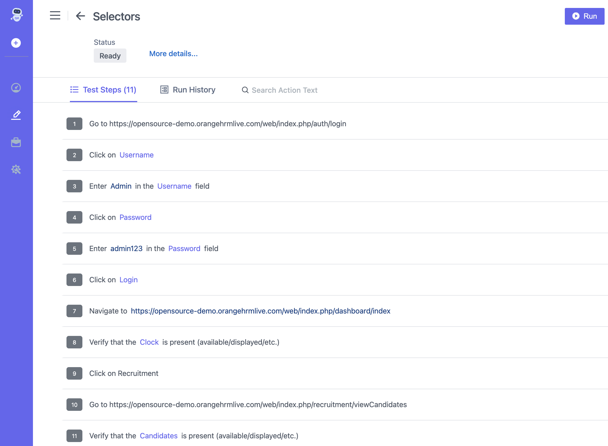

## Video
[Video](https://youtu.be/hJJa91jPoWo)

## Steps

1. Go to **ContextQA Portal** 
2. On left hand side there will be a **Pencil Icon.**
3. Choose a **Test case** From the Design And Development List 
4. The list of **Test cases* will be displayed as shown In the screenshot below 

5. On the right-hand side, There is a **Create** button as in the screenshot below
6. Click on **Create** button 

7. Enter the **Test Case** **Name** in the box as shown in the screenshot above 

8. On the right-hand side, there is a **Create** Button. Click on it. 
9. A message **Test Case Created Successfully** will be shown at the bottom left of the screen.	

## Example

**Test Case: Verify Login and Recruitment Functionality in OrangeHRM**

## Objective
To ensure that the user can successfully log in to the OrangeHRM application, navigate to the Dashboard, and access the Recruitment section with the correct credentials.

## Test Steps
0. Go to https://opensource-demo.orangehrmlive.com/web/index.php/auth/login 
1. Click on Username 
2. Enter Admin in the Username field 
3. Click on Password 
4. Enter admin123 in the Password field 
5. Click on Login 
6. Navigate to https://opensource-demo.orangehrmlive.com/web/index.php/dashboard/index 
7. Verify that the Clock is present (available/displayed/etc.) 
9. Click on Recruitment 
10. Go to https://opensource-demo.orangehrmlive.com/web/index.php/recruitment/viewCandidates 
11. Verify that the Candidates is present (available/displayed/etc.) 

**Expected Outcome**
The user should be able to log in with the correct credentials, view the Clock on the Dashboard, navigate to the Recruitment section, and see the Candidates table without any issues.